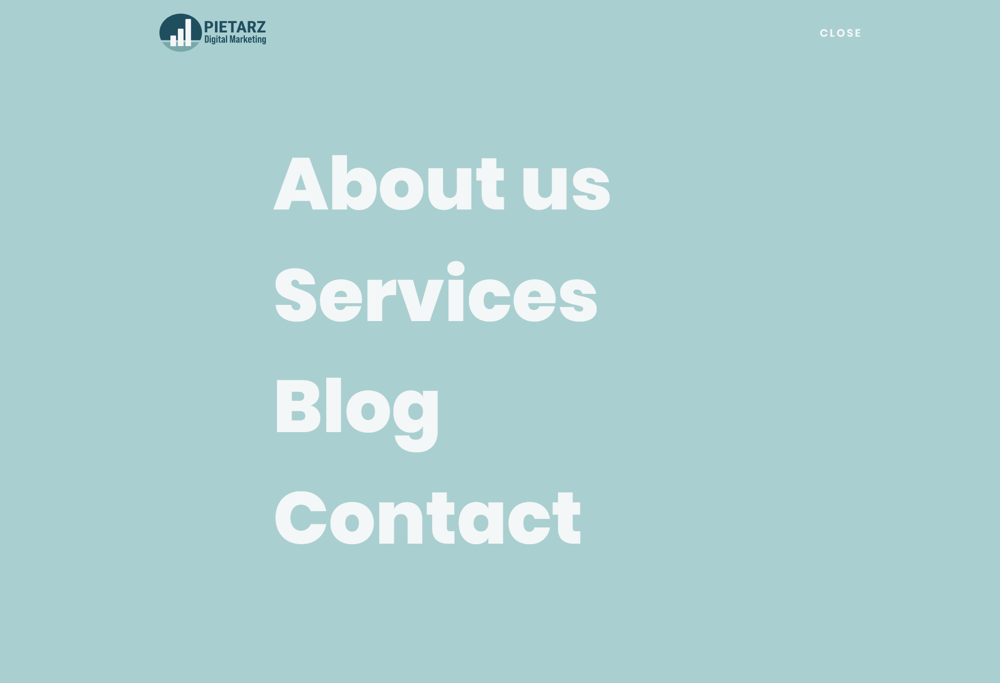
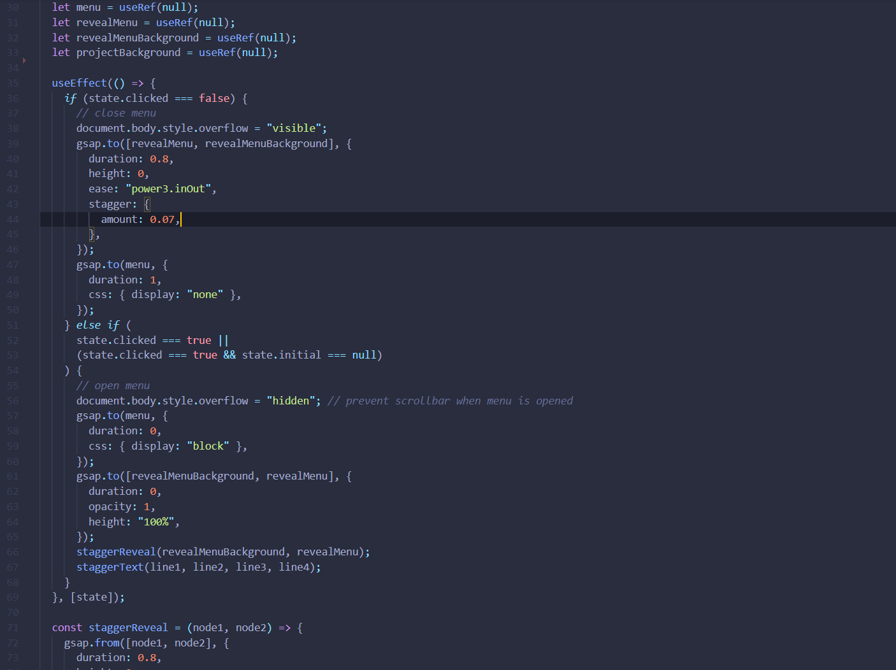

[Website preview](https://pietarzdm.netlify.app)

The idea is to create a site that stands out from other websites. Using an animation library I have created a unique menu that functions as an overlay. The framework used is React, while using WordPress as a headless CMS. The WordPress API works very well for this purpose.

Tech used:
- React
- GSAP
- aos
- axios

## Greensock (GSAP)
GSAP is a great library for animating elements. The community and support is great.

