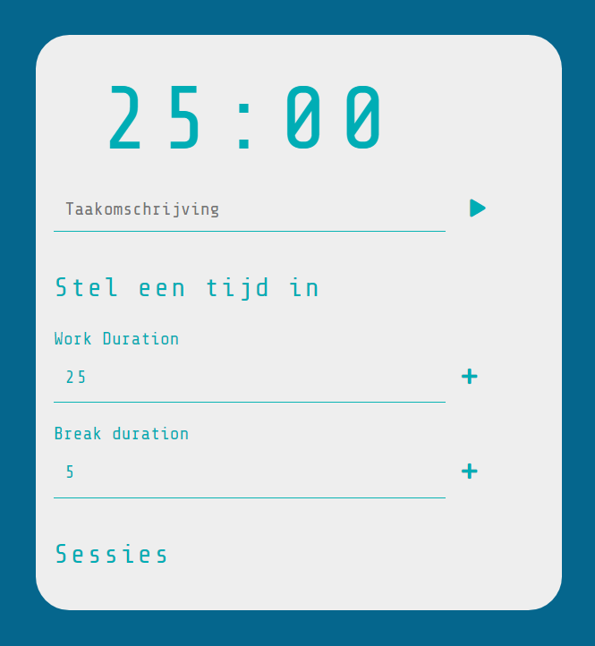

I often found myself using my mobile phone to track sessions. I decided to create myself a web application where I could track my sessions and configure durations easily.

[GitHub](https://github.com/axejah/pomodoro)   
[Demo](https://kevines.tech/pomodoro/)

<Info>

The Pomodoro Technique is a time management method developed by Francesco Cirillo in the late 1980s. The technique uses a timer to break down work into intervals, traditionally 25 minutes in length, separated by short breaks. Each interval is known as a pomodoro, from the Italian word for 'tomato', after the tomato-shaped kitchen timer that Cirillo used as a university student.

The technique has been widely popularized by dozens of apps and websites providing timers and instructions. Closely related to concepts such as timeboxing and iterative and incremental development used in software design, the method has been adopted in pair programming contexts.

</Info>