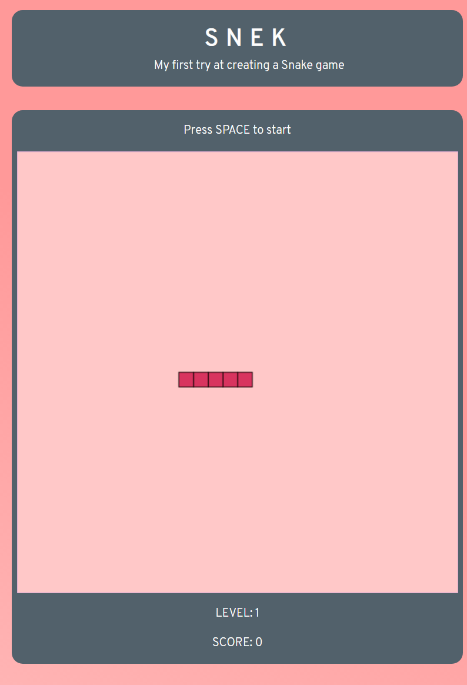

[GitHub](https://github.com/axejah/snek)   
[Demo](https://kevines.tech/snek)

I have wanted to start learning to program in the past, but had other priorities back then. I once got told: 'If you want to learn how to program, start on creating a Snake game'.

After a few years I actually still followed up on his advise. This proved to be a good practise. You really get to think programmatically.

